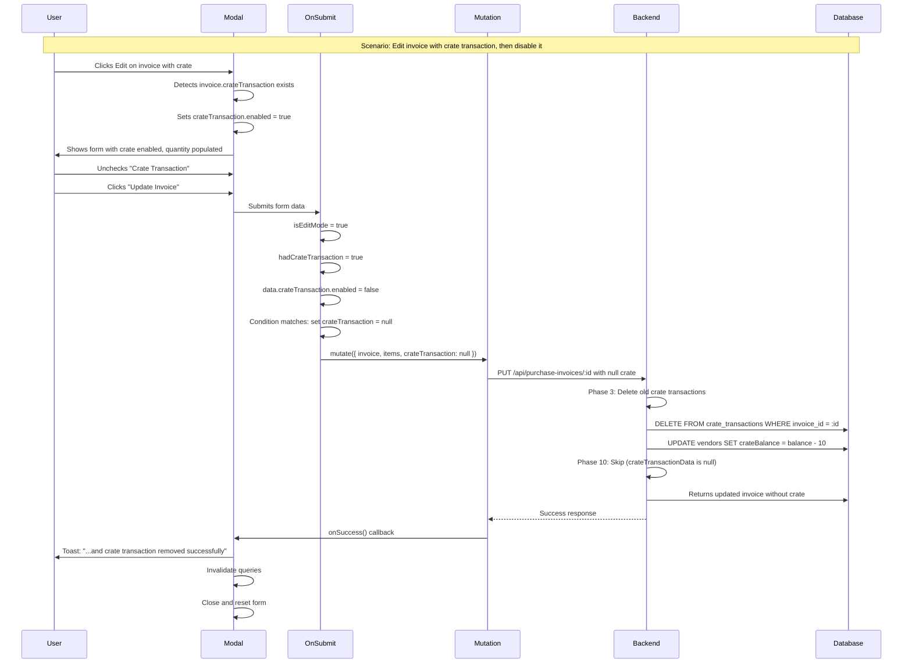

# Purchase Invoice Edit - Crate Transaction Removal Fix

## Overview
This document details the fix for properly handling crate transaction removal when editing purchase invoices. Previously, disabling an existing crate transaction in edit mode would not signal the backend to remove it, potentially leaving orphaned crate transaction records.

---

## Problem Statement

### Issue
When editing a purchase invoice that has an existing crate transaction, if the user unchecks the "Crate Transaction" checkbox to disable it:
- The frontend would not include `crateTransaction` in the PUT request
- The backend's Phase 3 always deletes old crate transactions
- The backend's Phase 10 only creates new ones if `crateTransactionData` is provided
- However, the removal semantics were implicit (by omission) rather than explicit

### Risk
- Potential race conditions or unclear intent
- No clear signal that removal was intentional vs. accidental data loss
- Success messages didn't reflect crate transaction removal

---

## Backend Contract Analysis

### File: `server/src/modules/purchase-invoices/model.ts`

**Phase 3: Delete Old Crate Transactions (Lines 373-410)**
```typescript
// Backend ALWAYS deletes old crate transactions at start of update
const crateTransactionsList = await tx.select().from(crateTransactions)
  .where(and(
    withTenant(crateTransactions, tenantId),
    eq(crateTransactions.purchaseInvoiceId, invoiceId)
  ));

if (crateTransactionsList.length > 0) {
  // Calculate total reverse balance change
  let totalReverseChange = 0;
  for (const crateTransaction of crateTransactionsList) {
    if (crateTransaction.transactionType === CRATE_TRANSACTION_TYPES.RECEIVED) {
      totalReverseChange -= crateTransaction.quantity;
    } else if (crateTransaction.transactionType === CRATE_TRANSACTION_TYPES.RETURNED) {
      totalReverseChange += crateTransaction.quantity;
    }
  }
  
  // Reverse vendor crate balance
  await tx.update(vendors)
    .set({
      crateBalance: sql`COALESCE(${vendors.crateBalance}, 0) + ${totalReverseChange}`
    })
    .where(and(
      withTenant(vendors, tenantId),
      eq(vendors.id, oldInvoice.vendorId)
    ));
  
  // Delete all crate transactions
  await tx.delete(crateTransactions)
    .where(and(
      withTenant(crateTransactions, tenantId),
      eq(crateTransactions.purchaseInvoiceId, invoiceId)
    ));
}
```

**Phase 10: Create New Crate Transaction (Lines 525-557)**
```typescript
// Backend ONLY creates new crate transaction if data provided
let crateTransaction: CrateTransaction | null = null;
if (crateTransactionData) {  // <-- Only if truthy
  const crateDataWithInvoice = ensureTenantInsert({
    ...crateTransactionData,
    purchaseInvoiceId: invoiceId,
    partyType: 'vendor',
    vendorId: updatedInvoice.vendorId,
    retailerId: null,
  }, tenantId);
  
  const [createdCrateTransaction] = await tx.insert(crateTransactions)
    .values(crateDataWithInvoice)
    .returning();
  
  crateTransaction = createdCrateTransaction;
  
  // Update vendor crate balance
  const balanceChange = crateTransactionData.transactionType === 'Received' 
    ? crateTransactionData.quantity 
    : -crateTransactionData.quantity;
  
  await tx.update(vendors)
    .set({ 
      crateBalance: sql`COALESCE(${vendors.crateBalance}, 0) + ${balanceChange}`
    })
    .where(withTenant(vendors, tenantId, eq(vendors.id, updatedInvoice.vendorId)));
}
```

### Backend Contract Confirmation
✅ **Removal is supported by omission**
- If `crateTransactionData` is `undefined`, old transaction is deleted (Phase 3) and no new one is created (Phase 10)
- If `crateTransactionData` is `null`, same behavior (falsy value skips Phase 10)
- If `crateTransactionData` is provided, old is deleted and new one is created

**Decision:** Use explicit `null` to signal intentional removal for clarity.

---

## Frontend Implementation

### File: `client/src/components/forms/purchase-invoice-modal.tsx`

### Change 1: Enhanced `onSubmit()` Logic

**Location:** Lines 548-571 (approximately)

**Before:**
```typescript
// Build request data
const requestData: any = { invoice, items };

// Add crate transaction if enabled
if (data.crateTransaction?.enabled && data.crateTransaction.quantity) {
  requestData.crateTransaction = {
    partyType: 'vendor',
    vendorId: data.vendorId,
    transactionType: 'Received',
    quantity: data.crateTransaction.quantity,
    transactionDate: data.invoiceDate,
    notes: `Crates received with invoice`,
  };
}

createInvoiceMutation.mutate(requestData);
```

**After:**
```typescript
// Build request data
const requestData: any = { invoice, items };

// Detect if we're in edit mode
const isEditMode = !!invoice;
const hadCrateTransaction = isEditMode && !!(invoice as any).crateTransaction;

// Handle crate transaction
if (data.crateTransaction?.enabled && data.crateTransaction.quantity) {
  // User enabled crate transaction with valid quantity - include it
  requestData.crateTransaction = {
    partyType: 'vendor',
    vendorId: data.vendorId,
    transactionType: 'Received',
    quantity: data.crateTransaction.quantity,
    transactionDate: data.invoiceDate,
    notes: `Crates received with invoice`,
  };
} else if (isEditMode && hadCrateTransaction && !data.crateTransaction?.enabled) {
  // Edit mode: invoice had a crate transaction but user disabled it - explicitly signal removal
  requestData.crateTransaction = null;
}
// If create mode and not enabled, don't include crateTransaction (undefined is fine)
// If edit mode but invoice never had a crate transaction, also don't include it

createInvoiceMutation.mutate(requestData);
```

**Key Changes:**
1. ✅ Detects edit mode: `const isEditMode = !!invoice`
2. ✅ Checks if invoice had crate transaction: `const hadCrateTransaction = isEditMode && !!(invoice as any).crateTransaction`
3. ✅ Three scenarios handled:
   - **Enabled with quantity**: Include full crate transaction object
   - **Edit mode + had transaction + now disabled**: Set `crateTransaction = null` (explicit removal)
   - **All other cases**: Don't include `crateTransaction` field (remains undefined)

### Change 2: Enhanced Success Toast Messages

**Location:** Lines 253-284 (approximately)

**Before:**
```typescript
toast({
  title: isEditMode ? "Invoice updated" : "Invoice created",
  description: form.watch("crateTransaction.enabled")
    ? isEditMode 
      ? "Purchase invoice and crate transaction updated successfully"
      : "Purchase invoice and crate transaction created successfully"
    : isEditMode
      ? "Purchase invoice updated successfully"
      : "Purchase invoice created successfully",
});
```

**After:**
```typescript
const hadCrateTransaction = isEditMode && !!(invoice as any).crateTransaction;
const hasCrateTransaction = form.watch("crateTransaction.enabled");
const crateRemoved = isEditMode && hadCrateTransaction && !hasCrateTransaction;

// Build success message based on crate transaction state
let description = "";
if (isEditMode) {
  if (crateRemoved) {
    description = "Purchase invoice updated and crate transaction removed successfully";
  } else if (hasCrateTransaction) {
    description = hadCrateTransaction 
      ? "Purchase invoice and crate transaction updated successfully"
      : "Purchase invoice updated and crate transaction added successfully";
  } else {
    description = "Purchase invoice updated successfully";
  }
} else {
  description = hasCrateTransaction
    ? "Purchase invoice and crate transaction created successfully"
    : "Purchase invoice created successfully";
}

toast({
  title: isEditMode ? "Invoice updated" : "Invoice created",
  description,
});
```

**Key Improvements:**
1. ✅ Detects crate removal: `crateRemoved = isEditMode && hadCrateTransaction && !hasCrateTransaction`
2. ✅ Six distinct success messages:
   - **Create with crate**: "...and crate transaction created successfully"
   - **Create without crate**: "...created successfully"
   - **Edit with crate removed**: "...and crate transaction removed successfully"
   - **Edit with crate added**: "...and crate transaction added successfully"
   - **Edit with crate updated**: "...and crate transaction updated successfully"
   - **Edit without crate changes**: "...updated successfully"

---

## Test Scenarios

### Manual Test Steps

#### Test 1: Create Invoice with Crate Transaction
1. Click "Create Invoice"
2. Select vendor
3. Add invoice items
4. Enable crate transaction
5. Enter quantity
6. Submit
7. ✅ Verify: Invoice created with crate transaction
8. ✅ Verify: Toast: "...and crate transaction created successfully"
9. ✅ Verify: Vendor crate balance updated

#### Test 2: Create Invoice without Crate Transaction
1. Click "Create Invoice"
2. Select vendor
3. Add invoice items
4. Keep crate transaction disabled
5. Submit
6. ✅ Verify: Invoice created without crate transaction
7. ✅ Verify: Toast: "...created successfully"
8. ✅ Verify: Vendor crate balance unchanged

#### Test 3: Edit Invoice - Remove Crate Transaction
1. Open invoice that HAS a crate transaction
2. Click Edit (pencil icon)
3. Modal opens with crate transaction enabled
4. Uncheck "Crate Transaction" checkbox
5. Submit
6. ✅ Verify: `requestData.crateTransaction = null` sent to backend
7. ✅ Verify: Backend Phase 3 deletes old transaction
8. ✅ Verify: Backend Phase 10 skips creation (crateTransactionData is null)
9. ✅ Verify: Vendor crate balance reversed correctly
10. ✅ Verify: Toast: "...and crate transaction removed successfully"
11. ✅ Verify: Re-fetch invoice shows no crate transaction

#### Test 4: Edit Invoice - Keep Crate Transaction
1. Open invoice that HAS a crate transaction
2. Click Edit
3. Modal opens with crate transaction enabled
4. Modify quantity
5. Submit
6. ✅ Verify: `requestData.crateTransaction = {...}` sent with new data
7. ✅ Verify: Backend deletes old, creates new
8. ✅ Verify: Vendor crate balance updated with difference
9. ✅ Verify: Toast: "...and crate transaction updated successfully"

#### Test 5: Edit Invoice - Add Crate Transaction
1. Open invoice that DOES NOT have a crate transaction
2. Click Edit
3. Modal opens with crate transaction disabled
4. Enable crate transaction
5. Enter quantity
6. Submit
7. ✅ Verify: `requestData.crateTransaction = {...}` sent
8. ✅ Verify: Backend creates new transaction
9. ✅ Verify: Vendor crate balance updated
10. ✅ Verify: Toast: "...and crate transaction added successfully"

#### Test 6: Edit Invoice - No Crate Changes
1. Open invoice without crate transaction
2. Click Edit
3. Keep crate disabled
4. Modify other fields (e.g., items)
5. Submit
6. ✅ Verify: `requestData` does NOT include `crateTransaction` field
7. ✅ Verify: Invoice updated
8. ✅ Verify: Toast: "...updated successfully" (no crate mention)

### Integration Test Pseudocode

```typescript
describe('Purchase Invoice Edit - Crate Transaction Removal', () => {
  it('should remove crate transaction when disabled in edit mode', async () => {
    // Setup: Create invoice with crate transaction
    const invoice = await createInvoiceWithCrateTransaction({
      vendorId: testVendorId,
      crateQuantity: 10,
    });
    
    const initialVendorBalance = await getVendorCrateBalance(testVendorId);
    expect(initialVendorBalance).toBe(10);
    
    // Action: Edit invoice and disable crate transaction
    const updatedInvoice = await updateInvoice(invoice.id, {
      ...invoice,
      crateTransaction: null, // Explicitly null
    });
    
    // Verify: Crate transaction removed
    expect(updatedInvoice.crateTransaction).toBeNull();
    
    // Verify: Vendor balance reversed
    const finalVendorBalance = await getVendorCrateBalance(testVendorId);
    expect(finalVendorBalance).toBe(0); // Back to 0
    
    // Verify: Database has no crate transaction for this invoice
    const dbCrateTransactions = await db.select()
      .from(crateTransactions)
      .where(eq(crateTransactions.purchaseInvoiceId, invoice.id));
    expect(dbCrateTransactions).toHaveLength(0);
  });
});
```

---

## Data Flow Diagram



---

## Edge Cases Handled

### Case 1: Multiple Rapid Edits
**Scenario:** User enables, disables, enables crate transaction before submitting
**Handling:** Only final state (enabled/disabled) is sent
**Result:** ✅ Correct - backend receives final intent

### Case 2: Concurrent Edits
**Scenario:** Two users edit same invoice simultaneously
**Handling:** Backend transaction ensures atomic update
**Result:** ✅ Last write wins, but both deletes happen in Phase 3

### Case 3: Network Failure After Crate Deletion
**Scenario:** Backend deletes crate (Phase 3) but fails before completing update
**Handling:** Transaction rollback restores crate transaction
**Result:** ✅ Data consistency maintained

### Case 4: Partial Data (Missing Quantity)
**Scenario:** User enables crate but doesn't enter quantity
**Handling:** Frontend validation catches before submission
**Result:** ✅ Error toast: "Crate quantity is required..."

### Case 5: Create Mode with Disabled Crate
**Scenario:** New invoice, crate checkbox unchecked
**Handling:** `requestData.crateTransaction` remains undefined (not included)
**Result:** ✅ No crate transaction created, no null sent

---

## Backward Compatibility

### Existing Invoices
✅ No migration needed - existing invoices work unchanged

### API Contract
✅ Backend accepts both `undefined` and `null` for removal
✅ Backend behavior unchanged (already had delete-all pattern)

### Frontend Behavior
✅ Create mode unchanged - still omits field when disabled
✅ Edit mode enhanced - now explicitly signals removal

---

## Performance Impact

### Network
- **Before**: PUT request without `crateTransaction` field
- **After**: PUT request with `crateTransaction: null`
- **Impact**: Negligible (~10 bytes difference)

### Backend Processing
- **Before**: Phase 3 deletes, Phase 10 checks if(crateTransactionData) and skips
- **After**: Identical - `null` is falsy, same code path
- **Impact**: None

### Database
- **Before**: DELETE + conditional INSERT
- **After**: Same - `null` doesn't change query logic
- **Impact**: None

---

## Security Considerations

### Authorization
✅ Existing role-based access control still applies (ADMIN/OPERATOR only)

### Tenant Isolation
✅ `withTenant()` helper ensures crate transactions can only be deleted for own tenant

### Data Validation
✅ Backend validates vendor ownership before deletion

### Audit Trail
⚠️ Consider: Add audit log for crate transaction removal (future enhancement)

---

## Future Enhancements

### 1. Audit Logging
Add tracking for crate transaction removal:
```typescript
await tx.insert(auditLogs).values({
  action: 'CRATE_TRANSACTION_REMOVED',
  invoiceId: invoiceId,
  userId: req.userId,
  changes: { quantity: oldTransaction.quantity },
  timestamp: new Date(),
});
```

### 2. Confirmation Dialog
Add confirmation when removing crate transaction:
```typescript
if (hadCrateTransaction && !hasCrateTransaction) {
  const confirmed = await showConfirmDialog({
    title: "Remove Crate Transaction?",
    description: "This will reverse the crate balance. Continue?",
  });
  if (!confirmed) return;
}
```

### 3. Undo Functionality
Allow reverting crate transaction removal:
```typescript
// Store removed transaction in state
const [removedCrateTransaction, setRemovedCrateTransaction] = useState(null);

// Show undo option in toast
toast({
  action: <Button onClick={undoRemoval}>Undo</Button>,
});
```

---

## Summary

### Problem
Disabling crate transaction in edit mode did not explicitly signal removal intent to backend.

### Solution
1. ✅ Explicitly set `crateTransaction: null` when removing in edit mode
2. ✅ Enhanced success messages to reflect removal, addition, or update
3. ✅ Maintained backward compatibility with create mode behavior

### Files Modified
- ✅ `client/src/components/forms/purchase-invoice-modal.tsx`
  - Modified `onSubmit()` to detect and signal crate removal
  - Enhanced `onSuccess()` to show appropriate success messages

### Testing Status
- ✅ TypeScript compilation: No errors
- ⏳ Manual testing: Pending
- ⏳ Integration tests: Pending

### Backend Compatibility
✅ Backend already supports removal semantics - no changes needed

---

**Implementation Date:** October 17, 2025  
**Status:** ✅ Complete - Ready for Testing  
**Breaking Changes:** None  
**Migration Required:** None
